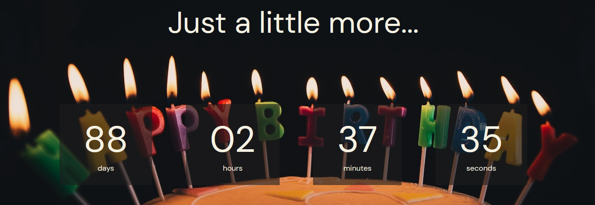

 <h1>Countdown Timer :hourglass:</h1>

This is my first repository on GitHub :tada: , and it contains a simple application built with pure HTML, CSS and JavaScript. The application is a countdown timer that points to a pre-configured specific date.

## How it works 
The application displays the countdown to the configured date, showing the number of remaining days, hours, minutes, and seconds until the expiration date. The user can configure the expiration date through the source code, changing the date specified in the `countdownDate` variable.

## Technologies used
- HTML
- CSS
- JavaScript

## How to run the application
1. Clone this repository to your machine.
2. Open the index.html file in the browser of your choice.
3. The application will be functioning and displaying the countdown to the configured date.

## Contributions
This is a simple project, but I am open to suggestions and contributions to improve the application. Feel free to make a fork of this repository and submit a pull request with your suggestions or corrections.

## Conclusion
This project was a great opportunity for me to learn more about HTML, CSS, and JavaScript and start my journey on GitHub. I hope you enjoy the application and feel free to contribute to its development.
